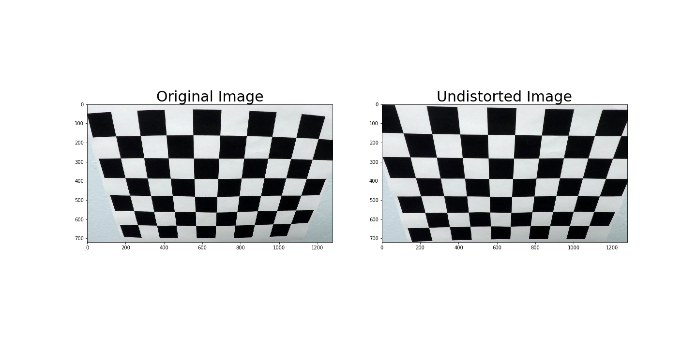
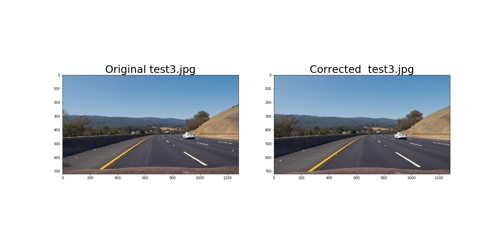
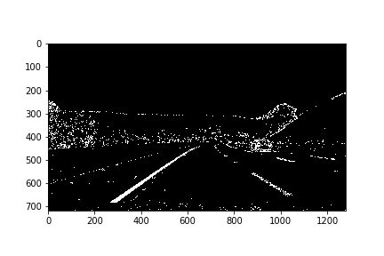
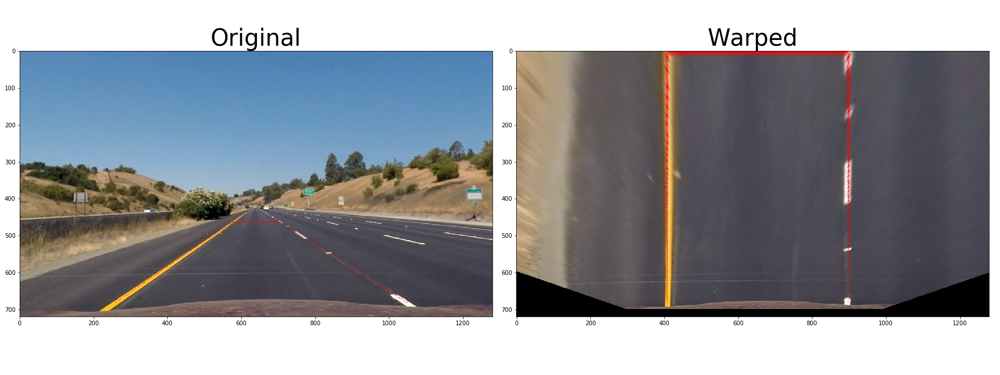
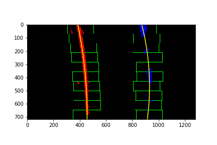
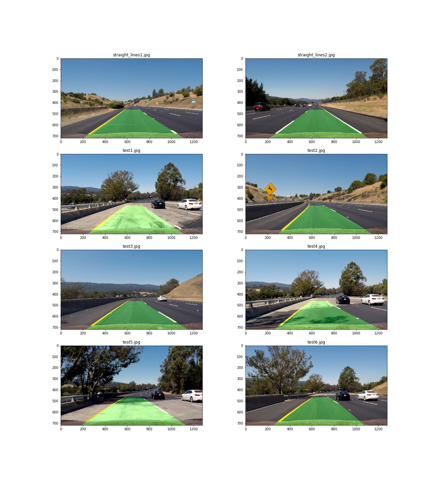

## [Rubric](https://review.udacity.com/#!/rubrics/571/view) Points

Here I will consider the rubric points individually and describe how I addressed each point in my implementation.  

---

### Camera Calibration

#### 1. Briefly state how you computed the camera matrix and distortion coefficients. Provide an example of a distortion corrected calibration image.

The camera calibration code could be found on the [CameraCalibration And CorrectionImages](./CameraCalibration_and_CorrectionImages.ipynb) notebook.  
I start by preparing "object points", which will be the (x, y, z) coordinates of the chessboard corners in the world. Here I am assuming the chessboard is fixed on the (x, y) plane at z=0, such that the object points are the same for each calibration image.  Thus, `objp` is just a replicated array of coordinates, and `objpoints` will be appended with a copy of it every time I successfully detect all chessboard corners in a test image.  `imgpoints` will be appended with the (x, y) pixel position of each of the corners in the image plane with each successful chessboard detection.  
I then used the output `objpoints` and `imgpoints` to compute the camera calibration and distortion coefficients using the `cv2.calibrateCamera()` function.  I applied this distortion correction to the test image using the `cv2.undistort()` function and obtained this result: 

---

### Pipeline (single images)

#### 1. Provide an example of a distortion-corrected image.
Camera calibration values ​​were made in [the CameraCalibration And CorrectionImages notebook](.\CameraCalibration_and_CorrectionImages.ipynb). Load that value with a pickle. The following image shows the result of applying camera calibration to one of the test images. The problem is that I need to convert from BGR to RGB when displaying 

#### 2. Describe how (and identify where in your code) you used color transforms, gradients or other methods to create a thresholded binary image.  Provide an example of a binary image result.

I used a combination of color and gradient thresholds to generate a binary image made in [the Thresholded Binary Image notebook](.\Thresholded_Binary_Image.ipynb
).  Here's an example of my output for this step. 

#### 3. Describe how (and identify where in your code) you performed a perspective transform and provide an example of a transformed image.

The code for my perspective transform includes a function called `warper()`, which could be found on [Perspective Transform notebook](./PerspectiveTransform.ipynb).
This resulted in the following source and destination points:

| Source     | Destination   | 
|:----------:|:-------------:| 
|  258, 682  | 258+150,  682 | 
|  575, 464  | 258+150,    0 |
|  707, 464  | 1049-150,   0 |
| 1049, 682  | 1049-150, 682 |

I verified that my perspective transform was working as expected by drawing the `src` and `dst` points onto a test image and its warped counterpart to verify that the lines appear parallel in the warped image.

#### 4. Describe how (and identify where in your code) you identified lane-line pixels and fit their positions with a polynomial?

The code for lane-line pixels includes a function called `find_lane_pixels()` and fit-polynomial includes a function called `fit_polynomial()`, which could be found on [Advanced Lane Finding notebook](./AdvancedLaneFinding.ipynb).

#### 5. Describe how (and identify where in your code) you calculated the radius of curvature of the lane and the position of the vehicle with respect to center.

The code for my calculated the radius and the center position includes a function called `drawData()`, which could be found on [Perspective Transform notebook](./PerspectiveTransform.ipynb).

#### 6. Provide an example image of your result plotted back down onto the road such that the lane area is identified clearly.

The code for my calculated the lane area includes a function called `drawLaneOnImage()`, which could be found on [Perspective Transform notebook](./PerspectiveTransform.ipynb).

---

### Pipeline (video)

#### 1. Provide a link to your final video output.  Your pipeline should perform reasonably well on the entire project video (wobbly lines are ok but no catastrophic failures that would cause the car to drive off the road!).

Here's a [link to my video result](./outputs/project_video.mp4)

---

### Discussion

#### 1. Briefly discuss any problems / issues you faced in your implementation of this project.  Where will your pipeline likely fail?  What could you do to make it more robust?

When a car arrives in the next lane, the area of ​​the lane can break down.
I may be able to improve by removing the non-lane object from the time change.
